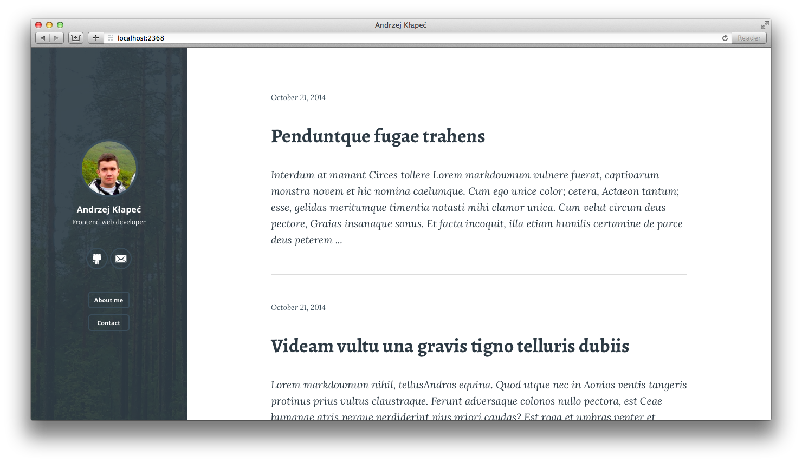

# Solid theme for Ghost

Minimal theme for Ghost with focus on typography.

## How to use

1. Place the ``solid`` folder into your ``Ghost/content/themes`` directory,
2. Restart Ghost (if running),
3. Set ``Solid-Ghost`` in your Ghost Admin settings.

## Development

1. ``npm install``
2. ``gulp``

## Screenshot

